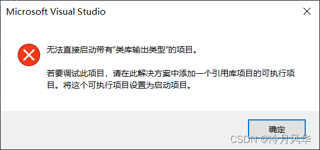
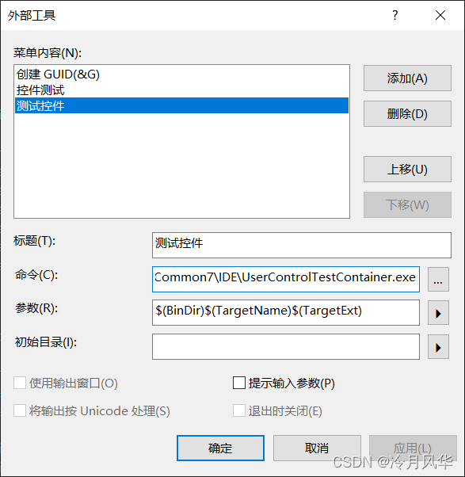
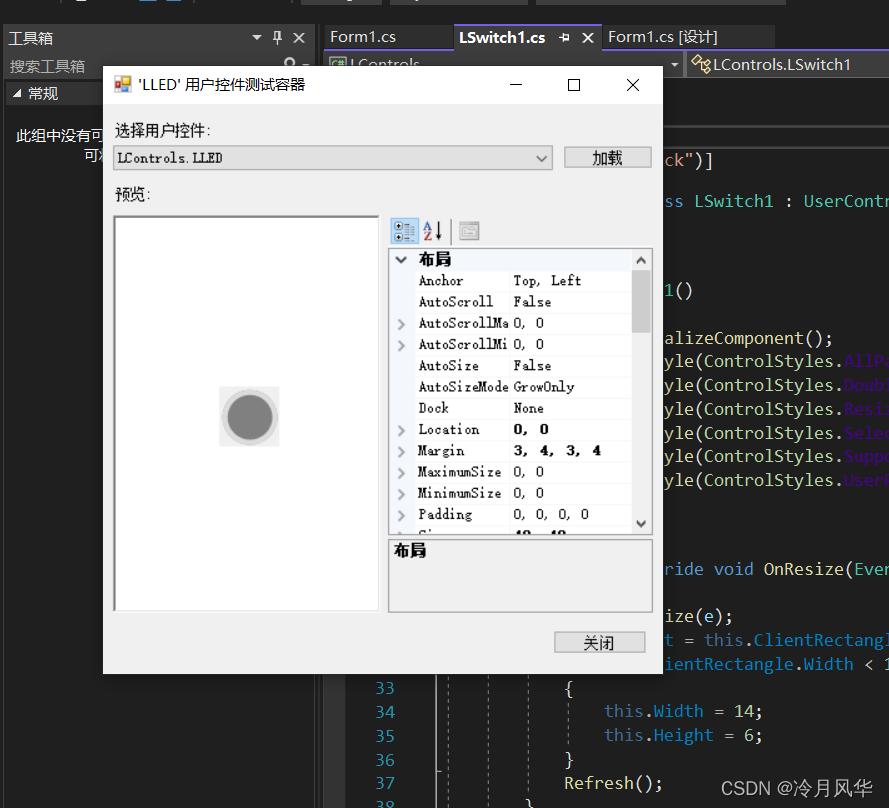
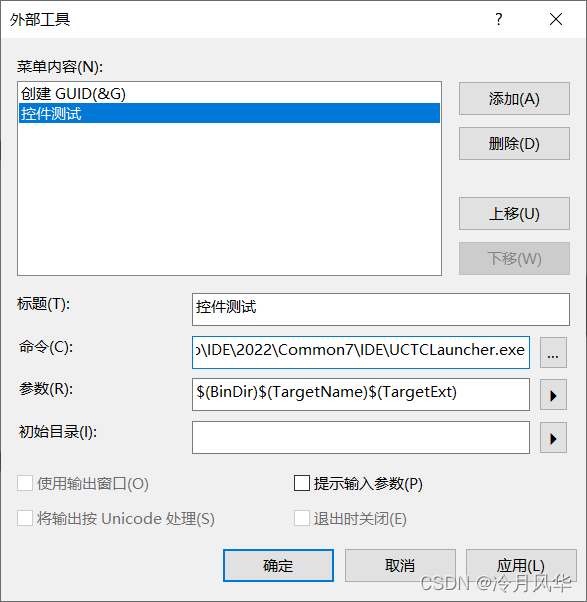
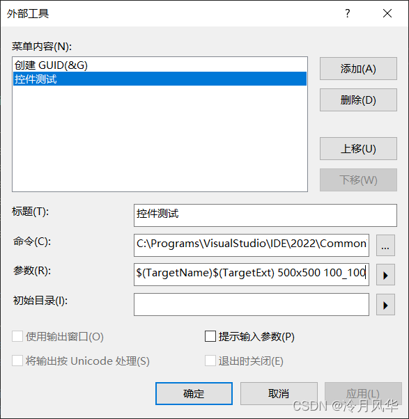
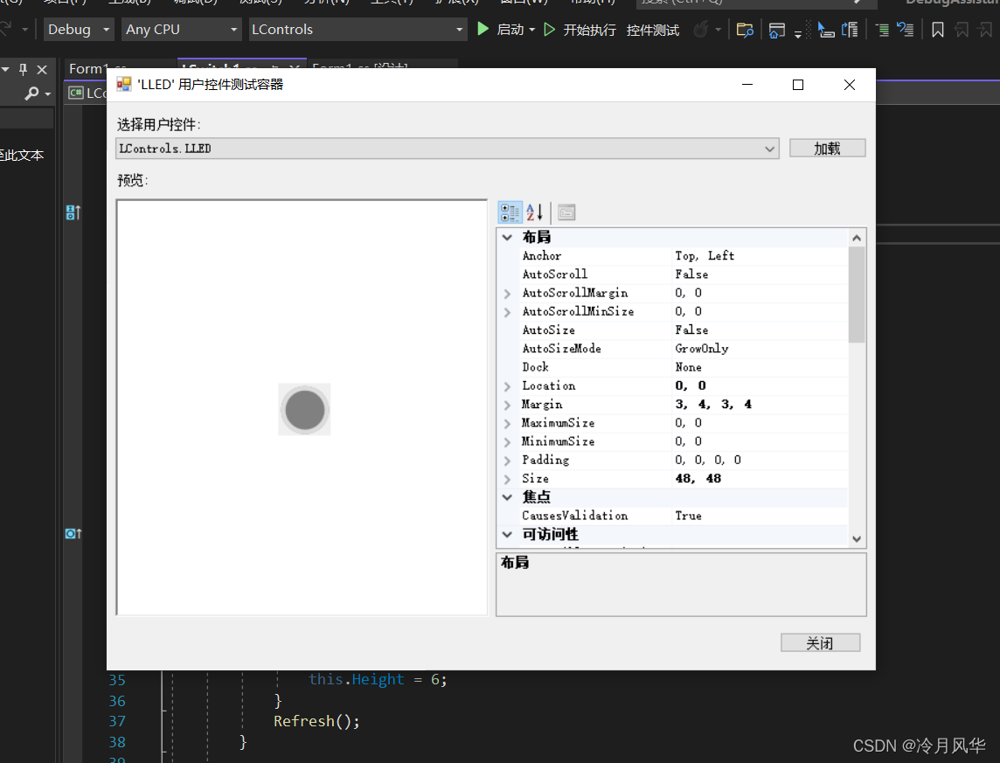

# Visual Studio用户控件测试容器配置方法

> 原创 已于 2025-12-07 00:09:38 修改 · 1.5k 阅读 · 0 · 2 · CC 4.0 BY-SA版权 版权声明：本文为博主原创文章，遵循 CC 4.0 BY-SA 版权协议，转载请附上原文出处链接和本声明。
> 文章链接：https://blog.csdn.net/aaa_8051/article/details/122514194

## Visual Studio用户控件测试容器配置方法

在Visual StudioCommunity版本下，创建用户控件库项目后，无法直接运行，会弹出如下图所示警告 

一种解决办法是创建新的WinForm项目，添加引用，拖动控件到窗体设计器上完成效果预览，此种办法比较麻烦，调试控件非常不方便，微软官方文档显示按下F5会自动启动用户控件测试容器，但是Community 版本貌似没有，现总结两种方法实现。

#### 第一种方法：直接执行UserControlTestContainer.exe文件

利用外部工具执行devenv.exe文件同目录下的UserControlTestContainer.exe文件，参数为控件项目的dll输出文件，如下图配置：
 

执行效果如图：
 

此种方法最简单，无需过多配置，但是其打开窗口较小，不利于调试参数，且位置偏左，不好使用(个人感觉)。

#### 第二种方法：利用UCTCLauncher.exe执行

UCTCLauncher.exe是用AutoHotkey脚本编写的简单的用户控件测试容器启动器，可设置窗口位置和大小，配置方法同第一两种类似，

- 第一步：
  ①下载 [UCTCLauncher.exe](https://lengyuefenghua.lanzouo.com/ioFQHytd79c) 
  (或者：有AutoHotkey环境的新建名为UCTCLauncher的脚本，复制如下代码，编译即可）

```c
#SingleInstance, Force
SendMode Input
SetWorkingDir, %A_ScriptDir%
SetTitleMatchMode, 2
DetectHiddenWindows, On
Width = 900
Height = 700
Posx = 400
Posy = 100
DLLPath = "-?"
if(A_Args[1] != "")
{
    if(SubStr(A_Args[1], -3) != ".dll")
    {
        MsgBox,, 错误提示,请定位至含有控件库的项目
        Exit
    }
    DLLPath := A_Args[1]
}
if(A_Args[2] != "")
{
    WH := StrSplit(A_Args[2], "x")
    Width := WH[1]
    Height := WH[2]
}
if(A_Args[3] != "")
{
    StartPos := StrSplit(A_Args[3], "_")
    Posx := StartPos[1]
    Posy := StartPos[2]
}
Try 
{
%DLLPath%
    Run UserControlTestContainer.exe %DLLPath%
    WinWait, 用户控件测试容器
    WinMove, 用户控件测试容器,, %Posx%, %Posy%, %Width%, %Height%
}
catch  
{
    MsgBox,, 错误提示, UCTCLauncher.exe同目录下不存在UserControlTestContainer.exe文件!
    Exit
}
```

- 第二步:复制UCTCLauncher.exe文件到devenv.exe同目录下，该目录下存在UserControlTestContainer.exe文件。

- 第三步：配置Visual Studio 外部工具执行参数，如下图所示 

  此外，如上图所示，若不添加额外参数，默认的启动位置为X=400,Y=100(窗体左上角相对于显示器的坐标)，默认宽度和高度为Width = 900，Height = 700
  自定义启动参数写法如下所示
   

  全部参数：

```
$(BinDir)$(TargetName)$(TargetExt) 500x500 100_100
```

其中：
第一个参数为控件项目输出DLL的全路径
第二个参数为启动的窗体大小宽度500，高度500，
第三个参数为窗体的启动位置，X=100,Y=100
效果如下图所示
 

