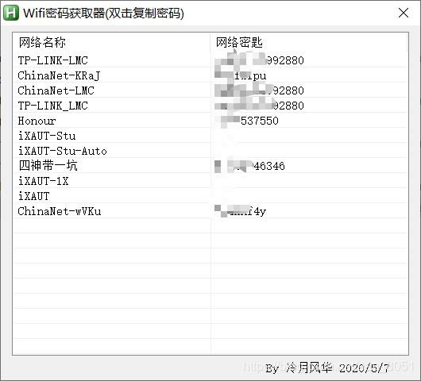

# win10查看wifi密码的三种方式（批处理和Autohotkey）

> 原创 于 2019-08-06 18:16:39 发布 · 4.1k 阅读 · 2 · 2 · CC 4.0 BY-SA版权 版权声明：本文为博主原创文章，遵循 CC 4.0 BY-SA 版权协议，转载请附上原文出处链接和本声明。
> 文章链接：https://blog.csdn.net/aaa_8051/article/details/98643014

**win10查看wifi密码（含一键获取）**

[TOC]


### 方法1命令行手动获取

```c
netsh wlan show profile name="WifiName" key=clear
```

打开命令行，将WifiName替换为所要查看WiFi名称即可获取前WiFi密码
若不知道WiFi名称，命令行运行以下代码

```c
netsh wlan show profile
```

### 方法2 批处理自动获取

运行以下批处理代码，一键获取所有连接过的WiFi密码

```c
@echo off

title WIFI密码获取
mode con cols=40 lines=15
color 0a 
   
echo 正在获取WIFI密码，请稍后···
if exist wifi_password.txt del wifi_password.txt

::获取WLAN配置文件----------------------------------------------------------
netsh wlan show profile>wifi_config.txt
setlocal EnableDelayedExpansion

::获取WiFi名称--------------------------------------------------------------
for /f "skip=10 tokens=* delims= " %%i in (wifi_config.txt) do (
set str=%%i
echo !str:~11!>>wifi_name.txt
)
del wifi_config.txt

::生成指令并提取密码--------------------------------------------------------
for /f %%i in (wifi_name.txt) do (
      set str=%%i
      netsh wlan show profile name="!str!" key=clear>>wifi_code.txt
	
      echo\>>wifi_password.txt
      echo.WIFI名称:>>wifi_password.txt
      echo !str!>>wifi_password.txt
	
	   for /f "delims=" %%j in ('findstr "关键内容" wifi_code.txt') do (
		  set tmp=%%j
		  echo.WIFI密码:>>wifi_password.txt
		  echo !tmp:~22!>>wifi_password.txt
		  del wifi_code.txt
	    )
    )
::完成---------------------------------------------------------------------	
del wifi_name.txt
echo WIFI密码获取成功！！！
C:\Windows\System32\notepad.exe %cd%\wifi_password.txt
del wifi_password.txt
exit
```

注：若获取失败请管理员身份运行！

### 方法3Autohotkey脚本自动获取（推荐）

 

源码

```bash
;WIFI密码获取
#SingleInstance force
Gui New,,Wifi密码获取器(双击复制密码)
Gui -MaximizeBox
Gui -MinimizeBox
Gui, add, listview,NoSortHdr r20 w400 grid gDoubleClick, 网络名称|网络密匙
Gui, Add, Text,,%A_Tab% %A_Tab% %A_Tab%  %A_Tab% %A_Tab%By 冷月风华 2020/5/7
LV_ModifyCol(1,198)
LV_ModifyCol(2,198)
Gui show 

runwait, %comspec% /c netsh wlan show profile | clip,, hide
Loop, parse, clipboard,`n,`r
{
    if a_index > 10
    {
         ;LV_Add("",SubStr(A_LoopField, 16))
         SSID .= SubStr(A_LoopField, 16) "`n"
    }  
}
Clipboard = 
Loop, parse, SSID, `n, `r
{
          ; MsgBox  %A_LoopField%
          runwait, %comspec% /c netsh wlan show profile "%A_LoopField%" key=clear | clip,, hide
          RegExMatch(clipboard,"关键内容            : (.*)",pp)
         LV_Add("",A_LoopField,SubStr(pp, 19))
}
SoundPlay *64
Clipboard = 
return

DoubleClick:
   LV_GetText(OutputVar1, A_EventInfo ,1)
   LV_GetText(OutputVar2, A_EventInfo ,2)
   Clipboard = %OutputVar2%
   MsgBox ,64,复制提示,网络名称:%OutputVar1%`n网络密匙:%OutputVar2%`n密码已成功复制至剪贴板！
return

GuiEscape:
GuiClose:
    ExitApp
```

AutoHotKey脚本在 [GitHub](https://github.com/lengyuefenghua/Get_Win10_WIFI_Password/releases/tag/V1.0) 或者 [蓝奏云](https://lengyuefenghua.lanzous.com/icclbgh) 