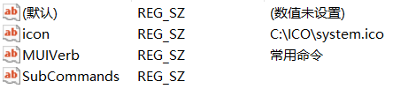
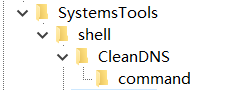
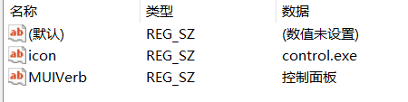
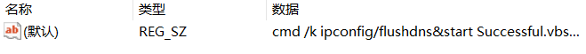
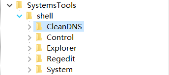
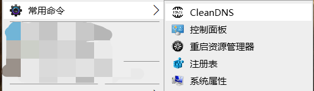

# windows10 桌面右键菜单自定义

> 原创 于 2020-03-03 19:31:56 发布 · 649 阅读 · 0 · 0 · CC 4.0 BY-SA版权 版权声明：本文为博主原创文章，遵循 CC 4.0 BY-SA 版权协议，转载请附上原文出处链接和本声明。
> 文章链接：https://blog.csdn.net/aaa_8051/article/details/104638752

## 桌面新建菜单修改

注册表路径

```c
计算机\HKEY_CLASSES_ROOT\DesktopBackground\Shell
```

右键Shell新建”项“名称随意，最好英文或拼音，本文例为SystemTools。
添加属性，右键新建项SystemTools，新建字符串值。
①添加图标属性：名称为icon，数据为ico图标文件绝对路径。
②添加名称属性：名称为MUIVerb，数据时你所需要的名称，也就是你需要在右键菜单显示的名称，中文英文均可。
③添加多级菜单属性（可选，视个人意愿）：名称为SubCommands，数据不填。
如图
 

 

如若不添加多级菜单，在新建项SystemTools下直接新建command子项，再在command项默认键值上直接修改添加程序路径即可
如图
 

 

若需要多级菜单，则需在最开始的新键项SystemTools下新建shell子项，开始新建子菜单。
①在SystemTools上右键新建子项（例：CleanDns）并在子项下新建command子项
 

②修改CleanDNS子项属性
 

③添加命令，在CleanDNS子项command中修改默认键值数据为程序路径
 

如此完成二级菜单的添加。
以此类推，可添加其他子菜单项
效果如图
注册表
 

右键菜单
 

完成！
如果平时不想显示，可以给SystemTools项添加Extended 属性，如此仅在按下shift’并右键时才会出现菜单