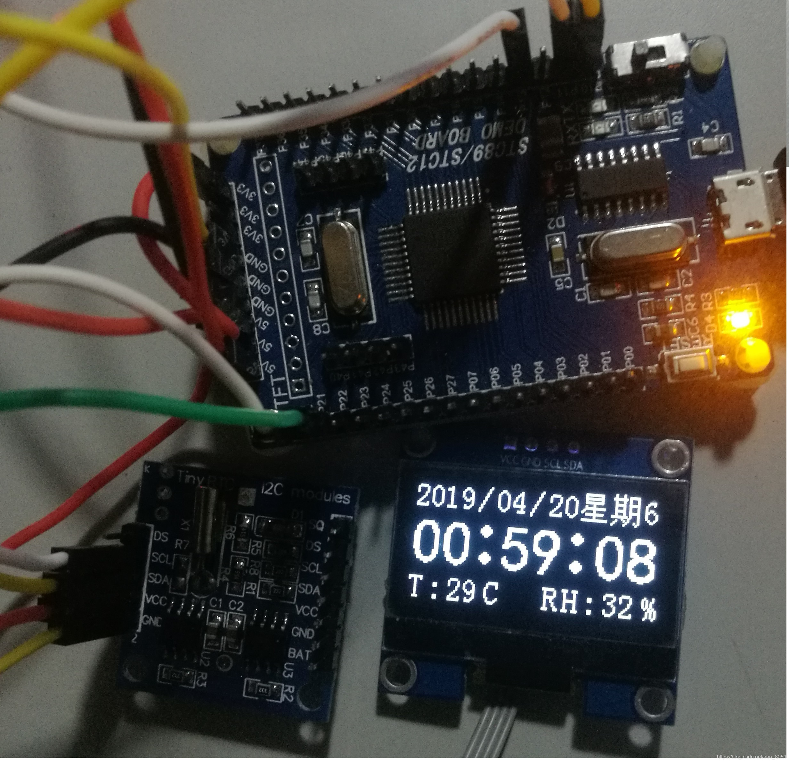

# 单片机IIC总线(实测通过)

> 原创 已于 2025-12-07 00:08:30 修改 · 1.4k 阅读 · 3 · 10 · CC 4.0 BY-SA版权 版权声明：本文为博主原创文章，遵循 CC 4.0 BY-SA 版权协议，转载请附上原文出处链接和本声明。
> 文章链接：https://blog.csdn.net/aaa_8051/article/details/89575729

不讲原理(网上详细讲原理的有很多)，只讲其代码实现。对于单片机使用者来说，IIC总线通讯实现具体分两种，一种是硬件实现，另一种是软件模拟，硬件实现相对简单，一般芯片数据手册会提供官方例程，只需要配置寄存器就可以，所以今天不讲IIC的硬件实现。至于软件模拟，大部分会用在相对低端的芯片上，比如89C51/52系列等，有时即便是带有硬件IIC的芯片也会使用软件模拟，因为有些硬件IIC做的并不完美。下面就以代码加注释的方式实现IIC通讯。（说明：测试单片机为STC12C5A60S2，晶振11.0592M，完全测试通过）

## C文件

```c
#include "IIC.h"
void Delayms(unsigned int ms)		//毫秒级延时函数
{
	unsigned char i, j;
	unsigned int k;
	for(k=0;k<ms;k++)
	{
			_nop_();
			i = 11;
			j = 190;
			do
			{
				while (--j);
			} while (--i);
	}
}
void Delay2us()	     //2us延时，用于稳定IO状态
{
	unsigned char i;

	_nop_();
	_nop_();
	i = 2;
	while (--i);
}
void IIC_Delay()	//IIC延时，需大于4.7us，这里取8us
{
		unsigned char i;
	  i = 19;
	  while (--i);
}
void IIC_IO_Init()      //IO口初始化，使总线处于空闲状态
{
    IIC_SCL = 1;
    IIC_SDA = 1;
}
void IIC_Start()      //总线开始
{
	IIC_SDA = 1;
    IIC_SCL = 1;
	IIC_Delay();
	
	IIC_SDA = 0;
	IIC_Delay();
	IIC_SCL = 0;
	IIC_Delay();	
}
void IIC_Stop()   //总线结束
{
	IIC_SCL = 0;
	IIC_SDA = 0;
	IIC_Delay();

	IIC_SCL = 1;
	IIC_Delay();
	IIC_SDA = 1;
	IIC_Delay();	
}
void IIC_Ack()         //应答
{
		IIC_SCL = 0;
		IIC_SDA = 0;
		IIC_Delay();
		IIC_SCL = 1;
		IIC_Delay();
		IIC_SCL = 0;
		IIC_Delay();
}
void IIC_NAck()     //无应答
{
	IIC_SCL = 0;
	IIC_SDA = 0;
	IIC_Delay();
  IIC_SDA = 1;
	IIC_Delay();
	IIC_SCL = 1;
	IIC_Delay();
	IIC_SCL = 0;
	IIC_Delay();
}
bit IIC_WaitAck()    //0 有应答 1 无应答
{
	unsigned char timeout = 1000;
	IIC_SDA = 1;
	Delay2us();
  IIC_SCL = 1;
	Delay2us();
	while(IIC_SDA)
	{
		timeout--;
		if(!timeout)
			return 1;   //无应答
	}
	IIC_SCL = 0;
  IIC_Delay();
	return 0;      // 有应答
}
void IIC_WriteByte(uchar Dat)     //向从设备写一字节数据
{
		uchar i = 0;
		for(i = 0;i < 8; i++)
		{
				IIC_SCL = 0;
				IIC_Delay();
				if(Dat&0x80)
				{
						IIC_SDA = 1;
				}
				else
				{
						IIC_SDA = 0;
				}
				IIC_Delay();
				IIC_SCL = 1;
				Dat<<= 1;
				IIC_Delay();
				IIC_SCL = 0;
		}
		IIC_SDA = 1;
		IIC_SCL = 1;
		IIC_Delay();
}
unsigned char IIC_ReadByte()		//由从设备读取一字节数据
{
		unsigned char i = 0,Dat = 0;
		IIC_SDA = 1;
		for(i =0; i < 8; i++)
		{
				IIC_SCL = 0;
				IIC_Delay();
				IIC_SCL = 1;
				IIC_Delay();
				Dat<<=1;
				Dat|= IIC_SDA;
				IIC_Delay();
				IIC_SCL = 0;
				IIC_Delay();
		}
		return Dat;
}

//以下两个函数非通用，不同IIC设备会有差异
void IIC_WriteData(unsigned char DeciceAddress,unsigned char RegisterAddress,unsigned char Dat)  //设备地址+写信号 寄存器地址 数据
{
		IIC_Start();
		IIC_WriteByte(DeciceAddress);
	  IIC_WaitAck();
		IIC_WriteByte(RegisterAddress);
	  IIC_WaitAck();
		IIC_WriteByte(Dat);
	  IIC_WaitAck(); 
		IIC_Stop();
	  Delay10ms();
}
unsigned char IIC_ReadData(unsigned char DeciceAddress,unsigned char RegisterAddress)  //设备地址+写信号  寄存器地址
{
		unsigned char Dat;
		IIC_Start();
		IIC_WriteByte(DeciceAddress);
	    IIC_WaitAck();
		IIC_WriteByte(RegisterAddress);
	    IIC_WaitAck();
		IIC_Start();
		IIC_WriteByte(DeciceAddress+1);  //由于IIC中0为写，1为读，故对写控制加1变为读控制
	    IIC_WaitAck();
		Dat = IIC_ReadByte();
		IIC_Stop();
		return Dat;
}
```

## H文件

```c
#ifndef _IIC_C_
#define _IIC_C_

#include "STC12C5A60S2.H"
#include "intrins.h"

#define IIC_SDA P10
#define IIC_SCL P11

void IIC_IO_Init();
void IIC_Delay();
void Delayms(unsigned int ms);
void IIC_Start();
void IIC_Stop();
void IIC_WriteByte(uchar Dat);
unsigned char IIC_ReadByte();
void IIC_Ack();
bit IIC_WaitAck();
void IIC_WriteData(unsigned char DeciceAddress,unsigned char RegisterAddress,unsigned char Dat);
unsigned char IIC_ReadData(unsigned char DeciceAddress,unsigned char RegisterAddress);

#endif
```

### 下面为程序测试结果，其中DS1307，OLED均为IIC通讯从设备

 

#### 若有问题，请留言联系

