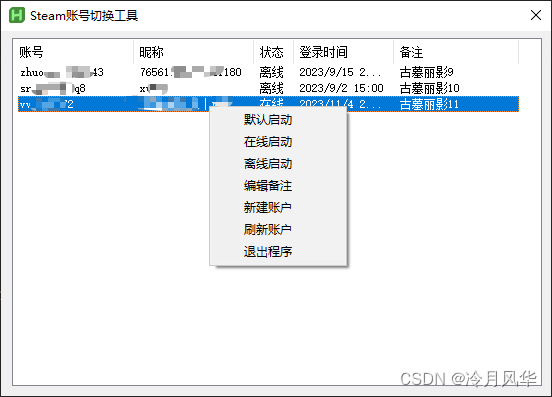
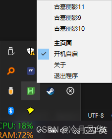
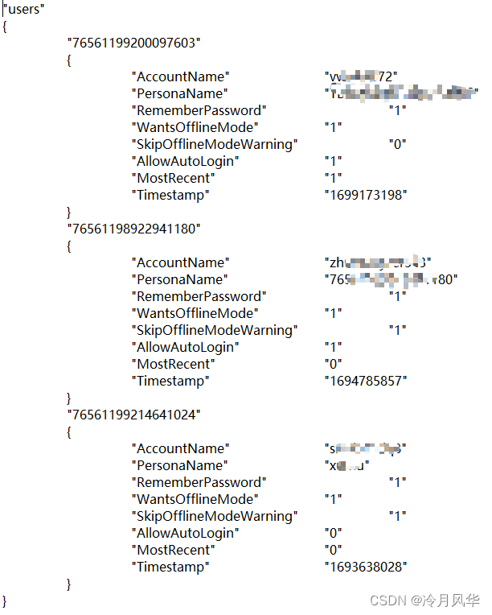

# 基于AutoHotkey的Steam账号切换器

> 原创 已于 2025-12-07 00:09:49 修改 · 1k 阅读 · 1 · 1 · CC 4.0 BY-SA版权 版权声明：本文为博主原创文章，遵循 CC 4.0 BY-SA 版权协议，转载请附上原文出处链接和本声明。
> 文章链接：https://blog.csdn.net/aaa_8051/article/details/134231654

## 一、界面展示

主页面
 

托盘页面
 

## 二、原理与实现

第一步：获取账户信息
读取Steam安装路径下config文件夹内的loginusers.vdf登录信息文件，获取账号名称，昵称、离线状态、登陆时间信息，文件如下所示：
 

第二步：注册表写入登录用户
向注册表键HKEY_CURRENT_USER\SOFTWARE\Valve\Steam中的AutoLoginUser写入需要登录的用户名（注意不是昵称，同时，需要该账户以记住密码的方式登录过一次）
第三步：启动Steam

说明1：需要离线启动时，将loginusers.vd文件中对应账户的WantsOfflineMode字段设置为1即可
说明2：新建账户时，只需要将AutoLoginUser清空即可

## 三、代码展示

Steam.ahk

```c
#Requires AutoHotkey v2.0

Class Steam{

    static SetStartupAccount(accountName := "")
    {
        try{
            RegWrite accountName, "REG_SZ", "HKEY_CURRENT_USER\SOFTWARE\Valve\Steam", "AutoLoginUser"
        }catch as e {
            Steam.Msgbox("账户切换失败" . Steam.ErrorFormat(e))
        }
        return
    }

    static SetStartMode(accountName, mode := "online"){
        if(mode = "online"){
            Steam.WriteAccountInfo(accountName, "WantsOfflineMode", 0)
        }else{
            Steam.WriteAccountInfo(accountName, "WantsOfflineMode", 1)
        }
        
    }

    static Start(){
        dir := Steam.GetSteamInfo()
        exe := dir . "/steam.exe"
        Steam.Stop()
        try{
            Run(exe,dir)
        } catch as e {
            Steam.Msgbox("Steam启动失败!" . Steam.ErrorFormat(e))
        }
        return
    }

    static Stop(){
        dir := Steam.GetSteamInfo()
        exe := dir . "/steam.exe -shutdown"
        if(PID := ProcessExist("steam.exe")){
            try{
                Run(exe,dir)
                count := 0
                while(ProcessExist("steam.exe")){
                    Sleep(500)
                    if(count++ > 30){
                        ExitCode := RunWait(A_ComSpec ' /c taskkill /f /t /im steam.exe', , "Hide")
                        break
                    }
                }
            }
        }
        return
    }

    static WriteAccountInfo(accountName, setting, data){
        settingsArr := Array("AccountName", "PersonaName", "RememberPassword", "WantsOfflineMode", "SkipOfflineModeWarning","AllowAutoLogin", "MostRecent", "Timestamp")
        settingIndex := 0
        flag := 0
        for key,value in settingsArr{
            if(value = setting){
                settingIndex := key
                flag := 1
                break
            }
        }
        if(flag = 0){
            Steam.Msgbox("写入失败，属性无效!")
            return
        }
        AccountInfo := Steam.ReadAccountInfo()
        AccountIndex := 0
        flag := 0
        accountName := "`"" . accountName . "`""
        for key,value in AccountInfo{
            if(value[2] = accountName){
                AccountIndex := key
                flag := 1
                break
            }
        }
        if(flag = 0){
            Steam.Msgbox("写入失败，账号不存在!")
            return
        }

        loginusersVDF := Steam.GetSteamInfo() . "/config/loginusers.vdf"
        AccountInfo[AccountIndex][settingIndex+1] := "`"" . data . "`""

        fo := FileOpen(loginusersVDF, "r")
		foenc := fo.Encoding
		fo.Close()
        fo := FileOpen(loginusersVDF, "w" , foenc)
        fo.Write("`"users`"" . "`n")
        fo.Write("{" . "`n")
        for key,value in AccountInfo{
            for k,v in value{
                if(k = 1){
                    fo.Write(A_Tab . v . "`n")
                    fo.Write(A_Tab . "{" . "`n")
                }else{
                    fo.Write(A_Tab . A_Tab . "`"" . settingsArr[k - 1] . "`"" . A_Tab . A_Tab . v . "`n")
                }
            }
            fo.Write(A_Tab . "}" . "`n")
        }
        fo.Write("}" . "`n")
        fo.Close()
        return
    }

    static ReadAccountInfo(){
        loginusersVDF := Steam.GetSteamInfo() . "/config/loginusers.vdf"
        if(temp0 := FileExist(loginusersVDF) and tempInfo := FileRead(loginusersVDF , "UTF-8")){
            accountArray := Array()
            FoundPos := RegExMatch(tempInfo, "`a`n`r)`"users`"\R{\K(.*)(?=\R})" , &result)
            TempString := StrReplace(result[0],"`n","#")
            StartPos := 1
            FoundPos := 1
            while(FoundPos){
                    FoundPos := RegExMatch(TempString, "`"(.*?)}", &Match, StartPos)
                    
                    if(Type(Match) != "String"){
                        StartPos := FoundPos + Match.Len[1]
                        tempArray := StrSplit(Match[1],"#")
                        arr := Array()
                        arr.Push("`"" . tempArray[1])
                        for key,value in tempArray{
                            if(key = 1 or key = 2 or key = 11)
                                continue
                            temp := StrSplit(value, A_Tab . A_Tab)
                            arr.Push(temp[3])
                        }
                        accountArray.Push(arr)
                    }       
            }
            return accountArray
            
        } else {
            Steam.MsgBox("未获取到登录信息，请至少登录一次!")
            return Array()
        }
    }

    static GetSteamInfo(){
        SteamPath := RegRead("HKEY_CURRENT_USER\SOFTWARE\Valve\Steam","SteamPath","Error")
        if(SteamPath = "Error"){
            Steam.Msgbox("未检测到已安装的Steam程序!")
            ExitApp
        }
        return steamPath
    }

    static Msgbox(data := ""){
        MsgBox(data, "提示", "48")
    }

    static GetLocalTime(EpochTime := ""){
        TimeStamp := 19700101000000
        TimeStamp := DateAdd(TimeStamp, EpochTime + 3600 * 8, "Seconds")
        return FormatTime(TimeStamp,"ShortDate") . " " . FormatTime(TimeStamp,"Time")
    }

    static ErrorFormat(e){
        return "`n#错误详情#`nMessage:" . e.Message . "`nWhat:" . e.What . "`nExtra:" . e.Extra . "File:" . e.File . "`nLine:" . e.Line
    }

}
```

Basic.ahk

```c
#Requires AutoHotkey v2.0


Class log
{
    static info(data := "",showtime := false,filename := "none")
    {
        outputstr := data
        timeStr := ""
        if(data = "")
            return
        if(showtime = true or filename != "none"){
            timeStr := log.GetTime()
        }
        if(IsObject(data)){
            outputstr := timeStr . log.ObjectToString(data) . "`n"
        } else {
            outputstr := timeStr . data . "`n"
        }
        if(A_IsCompiled = 1 or A_IsAdmin = 1){
            if(filename != "none"){
				FileAppend(outputstr, filename . ".log", "UTF-8")
			} else {
				MsgBox(outputstr)
			}
        } else {
			if(filename != "none"){
				FileAppend(outputstr, filename . ".log", "UTF-8")
			} else {
				FileAppend outputstr, "*", "CP65001"
			}
        }
    }

    static ObjectToString(object, depth:=6, indent:="") 
    {
        result := ""
        for key, value in object {
            result .= "`t" . indent . "[" . key . "]"
            if (IsObject(value) && depth > 1) {
                result .= "`n" . log.ObjectToString(value, depth - 1, indent . "`t")
            }
            else {
                result .= "`t=`t" . value . "`n"
            }
        }
        return result
    }

    static GetTime()
    {
        return A_YYYY . "-" . A_MM . "-" . A_DD . " " . A_Hour . ":" . A_Min . ":" . A_Sec . "." . (A_MSec + 0) . "`t"
    }

}

/************************************************************************
 * @author thqby
 * @date 2022/03/06
 * @version 1.0.1
 ***********************************************************************/
class child_process {
	pid := 0, hProcess := 0, onData := 0, onClose := 0
	stdin := 0, stdout := 0, stderr := 0, output := [], error := [], laststdoutindex := 0

	/**
	 * create a child process, then capture the stdout/stderr outputs.
	 * @param command The name of the module to be executed or the command line to be executed.
	 * @param args List of string arguments.
	 * @param sync Get the output by synchronous blocking method, `stdin` will be closed after `CreateProcess`.
	 * @param options The object or map with optional property.
	 * 
	 * `cwd` = '', Current working directory of the child process.
	 * 
	 * `input` = '', The value which will be passed as stdin to the child process.(only sync mode)
	 * 
	 * `encoding` = 'cp0' or ['cp0','cp0','cp0'], The encoding(s) of stdin/stdout/stderr.
	 * 
	 * `hide` = true, Hide the subprocess window that would normally be created on Windows systems.
	 * 
	 * `flags` = DllCall('GetPriorityClass', 'ptr', -1, 'uint'), The flags that control the priority class and the creation of the process.
	 * 
	 * `onData`, The callback function that is called when stdout/stderr receives data. Close the pipe when the callback returns true.
	 * 
	 * `onClose` The callback function that is called when stdout/stderr is closed.
	 */
	__New(command, args := unset, sync := false, options := 0) {
		handles := [], handles.DefineProp('__Delete', { call: closehandles })
		hide := true, flags := DllCall('GetPriorityClass', 'ptr', -1, 'uint')
		encoding := encoding_in := encoding_out := encoding_err := 'cp0'
		input := cwd := params := '', onData := onClose := 0
		if options
			for k, v in (options is Object ? options.OwnProps() : options)
				try %k% := v
		flags |= hide ? 0x08000000 : 0, this.onData := onData, this.onClose := onClose
		if encoding is Array {
			for i, v in ['in', 'out', 'err']
				encoding.Has(i) ? encoding_%v% := encoding[i] : 0
		} else encoding_in := encoding_out := encoding_err := encoding
		if IsSet(args) {
			if args is Array {
				for v in args
					params .= ' ' escapeparam(v)
			} else params := args
		} else if SubStr(command, 1, 1) = '"' || !FileExist(command)
			params := command, command := ''

		x64 := (A_PtrSize = 8), STARTUPINFO := Buffer(x64 ? 104 : 68, 0), PROCESS_INFORMATION := Buffer(x64 ? 24 : 16)
		NumPut('uint', x64 ? 104 : 68, STARTUPINFO), NumPut('uint', 0x100, STARTUPINFO, x64 ? 60 : 44)
		sp := NumPut('ptr', (handles.Push(t := this.Pipe('stdin', encoding_in)), t), sp := (x64 ? 80 : 56) + STARTUPINFO.Ptr)
		sp := NumPut('ptr', (handles.Push(t := this.Pipe('stdout', encoding_out)), t), sp)
		sp := NumPut('ptr', (handles.Push(t := this.Pipe('stderr', encoding_err)), t), sp)

		if !DllCall('CreateProcess', 'ptr', command ? StrPtr(command) : 0, 'ptr', params ? StrPtr(params) : 0, 'ptr', 0, 'int', 0,
			'int', true, 'int', flags, 'int', 0, 'ptr', cwd ? StrPtr(cwd) : 0, 'ptr', STARTUPINFO, 'ptr', PROCESS_INFORMATION)
			throw OSError(A_LastError)
		handles.Push(NumGet(PROCESS_INFORMATION, A_PtrSize, 'ptr')), handles := 0
		this.hProcess := NumGet(PROCESS_INFORMATION, 'ptr'), this.pid := NumGet(PROCESS_INFORMATION, 2 * A_PtrSize, 'uint')
		this.output.DefineProp('toString', { call: toString }), this.error.DefineProp('toString', { call: toString })
		if sync {
			this.stdin := input ? (this.stdin.Write(input), '') : ''
			while this()
				continue
		} else SetTimer(this, 20, 10000)
		closehandles(obj) {
			for h in obj
				DllCall('CloseHandle', 'ptr', h)
		}
		escapeparam(s) {
			s := StrReplace(s, '"', '\"', , &c)
			return c || RegExMatch(s, '[\s\v]') ? '"' RegexReplace(s, '(\\*)(?=(\\"|$))', '$1$1') '"' : s
		}
		toString(arr, begin := 0) {	; zero-based index
			static mIndex_offset := 6 * A_PtrSize + 16
			for v in (s := '', begin > 0 ? (NumPut('uint', begin - 1, ObjPtr(enum := arr.__Enum(1)), mIndex_offset), enum) : arr)
				s .= '`n' v
			return SubStr(s, 2)
		}
	}
	__Delete() {
		if this.hProcess
			DllCall('CloseHandle', 'ptr', this.hProcess), this.hProcess := 0
	}
	; create anonymous pipe
	Pipe(name, codepage) {
		static mFlags_offset := 4 * A_PtrSize + 8, USEHANDLE := 0x10000000
		if !DllCall('CreatePipe', "ptr*", &hPipeR := 0, "ptr*", &hPipeW := 0, 'ptr', 0, 'uint', 0)
			throw OSError(A_LastError)
		if name = 'stdin' {
			this.stdin := file := FileOpen(hPipeW, 'h', codepage), ptr := hPipeR
			file.DefineProp('Flush', { call: (s) => s.Read(0) })
		} else {
			this.%name% := file := FileOpen(hPipeR, 'h`n', codepage), ptr := hPipeW
			DllCall('SetNamedPipeHandleState', 'ptr', hPipeR, 'uint*', 1, 'ptr', 0, 'ptr', 0)	; PIPE_NOWAIT
		}
		p := ObjPtr(file), file.ptr := file.Handle
		NumPut('uint', NumGet(p, mFlags_offset, 'uint') & ~USEHANDLE, p, mFlags_offset)	; remove USEHANDLE flag, auto close handle
		DllCall('SetHandleInformation', 'ptr', ptr, 'int', 1, 'int', 1)
		return ptr
	}
	Clear() => this.output.Length := this.error.Length := this.laststdoutindex := 0
	GetLastStdout() => this.output.toString((t := this.laststdoutindex, this.laststdoutindex := this.output.Length, t))
	; wait process exit
	Wait(timeout := -1) => DllCall('WaitForSingleObject', 'ptr', this.hProcess, 'uint', timeout)
	; terminate process
	Terminate() {
		if this.hProcess
			DllCall('TerminateProcess', 'ptr', this.hProcess)
	}
	ExitCode => (DllCall('GetExitCodeProcess', 'ptr', this.hProcess, 'uint*', &code := 0), code)
	; get stdout/stderr output
	Call() {
		static outs := ['stdout', 'stderr']
		for k in (peek := 0, outs) {
			if !(f := this.%k%)
				continue
			out := k = 'stdout' ? this.output : this.error
			if DllCall('PeekNamedPipe', 'ptr', f, 'ptr', 0, 'int', 0, 'ptr', 0, 'ptr', 0, 'ptr', 0) && (t := '', ++peek) {
				while f {
					if t := t f.Read() {
						arr := StrSplit(t, '`n'), t := f.AtEOF ? '' : arr.Pop()
						for line in arr
							try if (out.Push(line), line) && this.onData(k, line) && (--peek, !f := this.%k% := 0) {
								try this.onClose(k)
								break 2
							}
					} else if f.AtEOF
						break
					else Sleep(5)
				}
			} else try this.%k% := f := 0, this.onClose(k)
		}
		; terminates the timer when the object is not referenced
		return peek && (this.onData || this.onClose || NumGet(ObjPtr(this), A_PtrSize, 'uint') > 2) ? peek : (SetTimer(this, 0), 0)
	}
}

RunTerminal(CmdLine, WorkingDir:="", Codepage:="CP0", Fn:="RunTerminal_Output") {  
    DllCall("CreatePipe", "PtrP",&hPipeR:=0, "PtrP",&hPipeW:=0, "Ptr",0, "Int",0)
  , DllCall("SetHandleInformation", "Ptr",hPipeW, "Int",1, "Int",1)
  , DllCall("SetNamedPipeHandleState","Ptr",hPipeR, "UIntP",&PIPE_NOWAIT:=1, "Ptr",0, "Ptr",0)
  
  , P8 := (A_PtrSize=8)
  , SI:=Buffer(P8 ? 104 : 68, 0)                          ; STARTUPINFO structure      
  , NumPut("UInt", P8 ? 104 : 68, SI)                                     ; size of STARTUPINFO
  , NumPut("UInt", STARTF_USESTDHANDLES:=0x100, SI, P8 ? 60 : 44)  ; dwFlags
  , NumPut("Ptr", hPipeW, SI, P8 ? 88 : 60)                              ; hStdOutput
  , NumPut("Ptr", hPipeW, SI, P8 ? 96 : 64)                              ; hStdError
  , PI:=Buffer(P8 ? 24 : 16)                              ; PROCESS_INFORMATION structure
  
    If not DllCall("CreateProcess", "Ptr",0, "Str",CmdLine, "Ptr",0, "Int",0, "Int",True
                  ,"Int",0x08000000 | DllCall("GetPriorityClass", "Ptr",-1, "UInt"), "Int",0
                  ,"Ptr",WorkingDir ? StrPtr(WorkingDir) : 0, "Ptr",SI.ptr, "Ptr",PI.ptr)  
       Return Format("{1:}", "", -1
                     ,DllCall("CloseHandle", "Ptr",hPipeW), DllCall("CloseHandle", "Ptr",hPipeR))
  
    DllCall("CloseHandle", "Ptr",hPipeW)
  ,PID := NumGet(PI, P8 ? 16 : 8, "UInt")
  , File := FileOpen(hPipeR, "h", Codepage)
  
  , LineNum := 1,  sOutput := ""
    While (PID + DllCall("Sleep", "Int",0))
      and DllCall("PeekNamedPipe", "Ptr",hPipeR, "Ptr",0, "Int",0, "Ptr",0, "Ptr",0, "Ptr",0)
          While PID and !File.AtEOF
              Line := File.ReadLine(), sOutput .= Type(Fn)="Func" ? Fn.Call(Line, LineNum++,&PID) : Line . "`n"
    PID := 0
  , hProcess := NumGet(PI, 0, "Ptr")
  , hThread  := NumGet(PI, A_PtrSize, "Ptr")
  
  , DllCall("CloseHandle", "Ptr",hProcess)
  , DllCall("CloseHandle", "Ptr",hThread)
  , DllCall("CloseHandle", "Ptr",hPipeR)
  
  Return sOutput  
  }

GetAdmin(){
    if not A_IsAdmin{
        Run('*RunAs "' A_AhkPath '" /restart "' A_ScriptFullPath '"')
        ExitApp
    }
}
```

Steam账号切换工具.ahk

```c
#Requires AutoHotkey v2.0
#SingleInstance Force

#Include "..\Lib\Steam.ahk"
#Include "..\Lib\Basic.ahk"

A_IconTip := "Steam账号切换工具"
;@Ahk2Exe-SetDescription Steam账号切换工具
;@Ahk2Exe-SetMainIcon logo.ico

StartUp := 0
HideMode := 1

if(A_Args.Length > 0){
    if(A_Args[1] = "-hide"){
        HideMode := 0
    }
}

Persistent(true)
AccountName := Steam.ReadAccountInfo()
InitConfig(AccountName)
AccountNote := ReadConfig()
MainGuiInit()
TrayMenuInit()

MainGuiInit()
{
    global MainGui, LV, ContextMenu, HideMode
    MainGui := Gui(, "Steam账号切换工具")
    MainGui.Opt("-MinimizeBox")
    MainGui.OnEvent("Close",Gui_Close)
    
    LV := MainGui.Add("ListView", "r20 w530 NoSortHdr NoSort -Multi -LV0x10", ["账号","昵称","状态","登录时间","备注"])
    LV.ModifyCol(1, 120)
    LV.ModifyCol(2, 120)
    LV.ModifyCol(3, 40)
    LV.ModifyCol(4, 100)
    LV.ModifyCol(5, 125)    
    Loop AccountName.Length
        {
            NewRowNumber := LV.Add(, 
                Trim(AccountName[A_Index][2],"`""), 
                Trim(AccountName[A_Index][3],"`""), 
                AccountName[A_Index][5] != "`"1`"" ? "在线" : "离线",
                Steam.GetLocalTime(Trim(AccountName[A_Index][9],"`"")),
                AccountNote[Trim(AccountName[A_Index][2],"`"")]
            )
        }
    LV.OnEvent("DoubleClick",LV_DoubleClick)
    LV.OnEvent("ContextMenu",LV_ContextMenu)

    ContextMenu := Menu()
    ContextMenu.Add("默认启动", CM_DefaultStart)
    ContextMenu.Add("在线启动", CM_OnlineStart)
    ContextMenu.Add("离线启动", CM_OfflineStart)
    ContextMenu.Add("编辑备注", CM_EditNote)
    ContextMenu.Add("新建账户", CM_NewAccount)
    ContextMenu.Add("刷新账户", CM_RefreshAccount)
    ContextMenu.Add("退出程序", CM_ExitApp)
    if(HideMode){
        MainGui.Show("w550 h365")
    }
}

TrayMenuInit()
{
    global TrayMenu
    TrayMenu := A_TrayMenu
    TrayMenu.Delete()
    for k,v in AccountName{
        if(k > 5){
            break
        }
        name := Trim(v[2],"`"")
        ItemName := AccountNote[name] != "None" ? AccountNote[name] : name
        TrayMenu.Add(ItemName,TM_GameList)
    }
    TrayMenu.Add()
    TrayMenu.Add("主页面",TM_ShouwMainGui)
    TrayMenu.Default := "主页面"
    TrayMenu.Add("开机自启",TM_StartUp)
    if(StartUp){
        TrayMenu.Check("开机自启")
    }else{
        TrayMenu.UnCheck("开机自启")
    }
    TrayMenu.Add("关于",TM_AboutMe)
    TrayMenu.Add("退出程序",TM_ExitApp)
}

TM_GameList(ItemName, ItemPos, MyMenu){
    accname := ""
    for k,v in AccountName{
        if(Trim(v[2],"`"") = ItemName){
            accname := Trim(v[2],"`"")
        }
    }
    if(accname = ""){
        for k,v in AccountNote{
            if(v = ItemName){
                accname := k
            }
        }
    }
    if(accname = ""){
        Steam.Msgbox("启动失败，账户信息无效!")
        return
    }
    Steam.SetStartupAccount(accname)
    Steam.Start()
}

TM_StartUp(ItemName, ItemPos, MyMenu){
    global TrayMenu,StartUp
    if(StartUp = 1){
        StartUp := 0
        SetStartUp("Disable")
        TrayMenu.UnCheck("开机自启")
        TrayTip "取消开机自启", "Steam账号切换工具", 1
        Sleep(2000)
        TrayTip
    }
    else{
        StartUp := 1
        SetStartUp("Enable")
        TrayMenu.Check("开机自启")
        TrayTip "设置开机自启", "Steam账号切换工具", 1
        Sleep(2000)
        TrayTip
    }
}

TM_ShouwMainGui(ItemName, ItemPos, MyMenu){
    MainGui.Show()
}

TM_ExitApp(ItemName, ItemPos, MyMenu){
    ExitApp
}

TM_AboutMe(ItemName, ItemPos, MyMenu){
    Msgbox("作者：冷月风华`n版本：v1.0`n日期：2023/09/03`n使用说明：`n1.选择账号双击即可启动`n2.可以在托盘菜单里快速启动游戏`n3.其他的可以自己尝试","关于")
}

CM_DefaultStart(*){
    Info := LV.GetNext(0, "F")
    if(Info >= 1 and Info <= AccountName.Length){
        Steam.SetStartupAccount(Trim(AccountName[Info][2],"`""))
        Steam.Start()
    }
}

CM_OnlineStart(*){
    Info := LV.GetNext(0, "F")
    if(Info >= 1 and Info <= AccountName.Length){
        Steam.SetStartupAccount(Trim(AccountName[Info][2],"`""))
        Steam.SetStartMode(Trim(AccountName[Info][2],"`""),"online")
        Steam.Start()
    }
}

CM_OfflineStart(*){
    Info := LV.GetNext(0, "F")
    if(Info >= 1 and Info <= AccountName.Length){
        Steam.SetStartupAccount(Trim(AccountName[Info][2],"`""))
        Steam.SetStartMode(Trim(AccountName[Info][2],"`""),"offline")
        Steam.Start()
    }
}

CM_EditNote(*){
    MainGui.GetPos(&X, &Y, &Width, &Height)
	posstr := "X" . String(X + Width / 2 - 150) . " Y" . String(Y + Height / 2 - 100) . " W300 H100"
	FocusedRowNumber := LV.GetNext(0, "F")
    selectedName := Trim(AccountName[FocusedRowNumber][2],"`"")
    if not FocusedRowNumber
        return
	IB := InputBox("设置 " . selectedName . " 的备注信息", "修改备注", posstr, AccountNote[selectedName])
	if IB.Result = "OK"
	{
		AccountNote[selectedName] = IB.Value
		WriteConfig(selectedName,IB.Value)
		LV.Modify(FocusedRowNumber , "Col5", IB.Value)
	}
}

CM_NewAccount(*){
    ResFlag := Msgbox("1.以记住密码的方式登录新账号`n2.等待登录完成进入Steam页面`n3.右键菜单选择刷新账户`n4.选择账号进行登录","提示：操作步骤",49)
	if(ResFlag = "OK")
	{
		steam.SetStartupAccount("")
        Steam.Start()
	}	
}

CM_RefreshAccount(*){
    global AccountName,AccountNote,LV
    AccountName := Steam.ReadAccountInfo()
    InitConfig(AccountName)
    AccountNote := ReadConfig()
    LV.Delete()
    Loop AccountName.Length
        {
            NewRowNumber := LV.Add(, 
                Trim(AccountName[A_Index][2],"`""), 
                Trim(AccountName[A_Index][3],"`""), 
                AccountName[A_Index][5] != "`"1`"" ? "在线" : "离线",
                Steam.GetLocalTime(Trim(AccountName[A_Index][9],"`"")),
                AccountNote[Trim(AccountName[A_Index][2],"`"")]
            )
        }
}

CM_ExitApp(*){
    ExitApp
}


LV_ContextMenu(LV, Item, IsRightClick, X, Y){
    ContextMenu.Show(X, Y)
}

LV_DoubleClick(GuiCtrlObj, Info){
    if(Info >= 1 and Info <= AccountName.Length){
        Steam.SetStartupAccount(Trim(AccountName[Info][2],"`""))
        Steam.Start()
    }
}

Gui_Close(this){
   this.Hide()
}

InitConfig(accountNameArr)
{    
	if(not FileExist("config.ini")){
        IniWrite(0, "config.ini", "AppSetting","StartUp")
    }
    sections := StrSplit(IniRead("config.ini"),"`n")
    for k,v in sections{
        if(v = "AppSetting"){
            break
        }
        flag := 0
        for k1,v1 in accountNameArr{
            if(v = Trim(accountNameArr[k1][2],"`"")){
                flag := 1
            }
        }
        if(flag = 0){
            IniDelete("config.ini",v)
        }
    }
    for k,v in accountNameArr{
        KeyValue := IniRead("config.ini", Trim(accountNameArr[A_Index][2],"`""), "Note", "Error")
        if(KeyValue = "Error" or KeyValue = "None"){
            WriteConfig(Trim(accountNameArr[A_Index][2],"`""),"None")
        }
    }
    KeyValue := IniRead("config.ini", "AppSetting", "StartUp", "Error")
    if(KeyValue = "Error"){
        IniWrite(0, "config.ini", "AppSetting","StartUp")
    }
}

WriteConfig(accountName,note := ""){
    IniWrite(note,"config.ini",accountName,"Note")
}

ReadConfig(){
    global StartUp
    noteMap := Map()
    sections := StrSplit(IniRead("config.ini"),"`n")
    for k,v in Sections{
        if(v = "AppSetting"){
            StartUp := IniRead("config.ini", v, "StartUp",0)
        }
        noteMap.Set(v,IniRead("config.ini", v, "Note","None"))
    }
    return noteMap
}

SetStartUp(parm := "Enable"){
    SplitPath(A_ScriptFullPath,,,,&StratName)
	if(parm = "Enable"){
		RegWrite(A_ScriptFullPath . " -hide","REG_SZ", "HKEY_CURRENT_USER\SOFTWARE\Microsoft\Windows\CurrentVersion\Run", StratName)
        IniWrite(1, "config.ini", "AppSetting","StartUp")
	}
	else{
		RegDelete("HKEY_CURRENT_USER\SOFTWARE\Microsoft\Windows\CurrentVersion\Run", StratName)
        IniWrite(0, "config.ini", "AppSetting","StartUp")
	}
}

```

说明：部分代码属于AutoHotkey论坛，时间太久，找不到原帖，故未注明出处。

## 四、软件下载

[蓝奏云](https://lengyuefenghua.lanzouy.com/iALXb1duxwqb) 