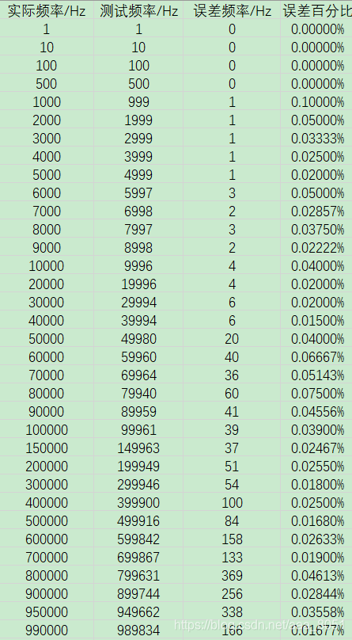

# 基于STC8单片机的频率计

> 原创 已于 2025-12-07 00:08:16 修改 · 3.6k 阅读 · 5 · 27 · CC 4.0 BY-SA版权 版权声明：本文为博主原创文章，遵循 CC 4.0 BY-SA 版权协议，转载请附上原文出处链接和本声明。
> 文章链接：https://blog.csdn.net/aaa_8051/article/details/99294382

## 基于STC8的频率计

测频原理：计数法测频率。
实现方法：利用51单片机定时器可作为外部脉冲计数器的特点，可实现频率计数。具体使用两个定时器，本例中，使用定时器0作为外部脉冲计数器，用于对外部脉进行捕获（下降沿触发），定时器3产生1s定时，用于提取计数频率。
代码如下

```c
//系统时钟频率 24MHz
#include "STC8.H"

bit send_flag = 0;
unsigned int freq = 0;     //频率计数
unsigned long cont_freq = 0;   //频率计数溢出
unsigned char res[6];   //频率转换结果

void TM0_Init();
void TM3_Init();
void UartSend(unsigned char dat);
void UartInit(void);
void UartSendStr(unsigned char *p);
void Num_Cut(unsigned long num);
void Uart_Send_Str(unsigned char str[],unsigned char len,bit mode);

void main ()
{
	TM0_Init();    
	TM3_Init();    
	UartInit();    
	while(1)
	{ 
    if(send_flag)
		{
        Num_Cut(cont_freq+(unsigned long)freq); //频率值等于溢出值加当前值
			  send_flag = 0;
			  UartSendStr("Freq: ");
				Uart_Send_Str(res,6,1);
				Uart_Send_Str(res,6,0);
				UartSendStr(" Hz\n");
		}
	}
} 
/******************************************************************************
 * 描  述 : 定时器3初始化函数，定时时间1ms
 * 入  参 : 无
 * 返回值 : 无
 ******************************************************************************/
void TM3_Init()
{
	 	T3L    = 0x35;																	//设置定时初值，1ms
	  T3H    = 0xA2;																	//设置定时初值
    T4T3M |= 0x08;                                  //启动定时器
	  T4T3M |= 0x02;															   //定时器时钟1T模式
    IE2   |= ET3;                                  //使能定时器中断
    EA     = 1;                                      //开总中断
}
/******************************************************************************
 * 描  述 :  定时器0初始化函数，外部计数模式
 * 入  参 :  无
 * 返回值 :  无
 ******************************************************************************/
void TM0_Init()
{
	  TMOD |= 0x04;                                //设置外部计数模式
	  TMOD |= 0x01;                                //工作模式1，16位不自动重载
	  TR0   = 1;                                    //打开计数器
    TH0   = 0x00;                                 //计数器复位
	  TL0   = 0x00;                                
	  ET0   = 1;                                    //开计数器中断
}
/******************************************************************************
 * 描  述 : 定时器0中断服务函数 
 * 入  参 : 无
 * 返回值 : 无
 ******************************************************************************/
void TM0_Isr() interrupt 1
{  
    cont_freq += 65536;    //溢出计数，每溢出一次，计数次数为TH0<<8|TL0 = 0xffff,经调试结果加1
	  TH0 = 0x00;            //复位计数器
	  TL0 = 0x00;            //复位计数器	
}
/******************************************************************************
 * 描  述 :   定时器3中断服务函数
 * 入  参 :   无
 * 返回值 :   无
 ******************************************************************************/
void TM3_Isr() interrupt 19
{   
  static unsigned int ms_flag = 0;  //1s计数标志
	if(ms_flag++ == 1000)
	{
		freq = (TH0<<8|TL0);           //获取当前计数器计数值          
		ms_flag = 0;                   //1s计数标志复位
		send_flag = 1;                 //串口发送标志位置位
	  TH0 = 0x00;                    //复位计数器
	  TL0 = 0x00;                    //复位计数器	
	}
	AUXINTIF &= ~T3IF;               //清中断标志
}
/******************************************************************************
 * 描  述 :  串口1初始化函数，波特率9600 
 * 入  参 :  无
 * 返回值 :  无
 ******************************************************************************/
void UartInit(void)		//9600bps@24.000MHz
{
	SCON |= 0x50;		//8位数据,可变波特率
	AUXR |= 0x01;		//串口1选择定时器2为波特率发生器
	AUXR |= 0x04;		//定时器2时钟为Fosc,即1T
	T2L   = 0x8F;		//设定定时初值
	T2H   = 0xFD;		//设定定时初值
	AUXR |= 0x10;		//启动定时器2
}
/******************************************************************************
* 描  述 : 串口字符发送和函数 
* 入  参 : 发送字符
* 返回值 : 无
******************************************************************************/
void UartSend(unsigned char dat)
{
    SBUF =dat;   		 
    while(!TI);		
	  TI=0;	
}
/******************************************************************************
* 描  述 : 串口字符串发送函数
* 入  参 : 发送字符串
* 返回值 : 无
******************************************************************************/
void UartSendStr(unsigned char *p)
{
    while (*p)
    {
        UartSend(*p++);
    }
}
 /******************************************************************************
 * 描  述 : 数字拆分函数
 * 入  参 : 拆分数字
 * 返回值 : 无
 ******************************************************************************/
void Num_Cut(unsigned long num)
{ unsigned long temp = num; 
	unsigned char cont = 5;
	while(temp != 0)
	{
		res[cont--] = (unsigned char)(temp % 10);
		temp /= 10;
	}
  cont_freq = 0;
}
/******************************************************************************
* 描  述 :  串口数字数组发送函数
* 入  参 :  str:数组，len：数组长度或者要发送数据长度，mode：1发送，0清零数组
* 返回值 : 
******************************************************************************/
void Uart_Send_Str(unsigned char str[],unsigned char len,bit mode)
{
	unsigned char k;
	if(mode == 1)
	{
		for(k = 0;k < len; k++)
		{
			UartSend(48 + str[k]);
		}	
	}else
	{
		for(k = 0;k < len; k++)
		{
			str[k] = 0;
		}
	}
}
```

测试结果分析如下：
 

