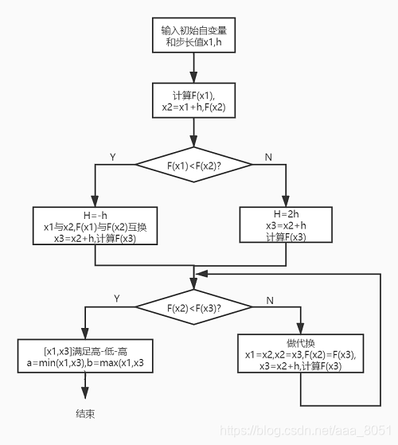
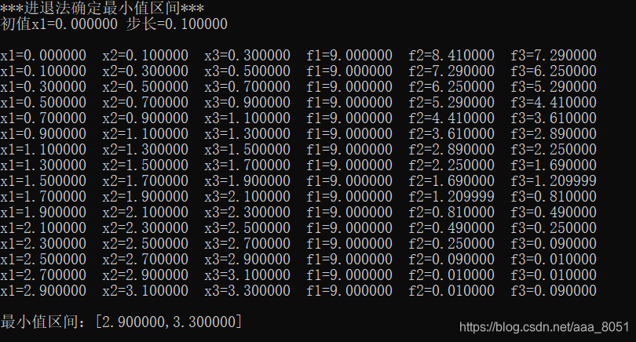

# 进退法确定最小值区间(C语言)

> 原创 已于 2025-12-07 00:09:03 修改 · 2.7k 阅读 · 5 · 27 · CC 4.0 BY-SA版权 版权声明：本文为博主原创文章，遵循 CC 4.0 BY-SA 版权协议，转载请附上原文出处链接和本声明。
> 文章链接：https://blog.csdn.net/aaa_8051/article/details/109095152

## 进退法确定最小值区间

- 优化设计

##### 进退法确定最小值所在区间程序框图



##### C语言程序

```c
#include <stdio.h>

//定义目标函数
#define F(x) (x*x-6*x+9)

void RetreatMethod(float X1,float H)
{
	float f1, f2, f3;
	float x1, x2, x3;
	float h, temp;
	//初值计算
	h = H;
	x1 = X1;
	f1 = F(x1);
	x2 = x1 + h;
	f2 = F(x2);
	printf("***进退法确定最小值区间***\r\n初值x1=%f 步长=%f\r\n\r\n", x1, h);
	if (f1 < f2)	//判断搜索方向
	{	
		//初始方向错误，反向搜索
		h = -h;
		//交换x1，x2
		temp = x2;
		x2 = x1;
		x1 = temp;
		//交换f1，f2
		temp = f2;
		f2 = f1;
		f1 = temp;
		//计算x3，f3
		x3 = x2 + h;
		f3 = F(x3);
	}
	else
	{		//初始方向正确，正向搜索
			//增大步幅，计算x3,f3
			h = 2*h;
			x3 = x2 + h;
			f3 = F(x3);
	}
	printf("x1=%f  x2=%f  x3=%f  f1=%f  f2=%f  f3=%f\r\n", x1, x2, x3, f1, f2, f3);
	//循环计算比较f2，f3，直至满足“高-低-高”条件
	while (!(f2 < f3))
	{
		x1 = x2;
		x2 = x3;
		f2 = f3;
		x3 = x2 + h;
		f3 = F(x3);
		printf("x1=%f  x2=%f  x3=%f  f1=%f  f2=%f  f3=%f\r\n", x1, x2, x3, f1, f2, f3);
	}
	//输出最小值区间
	if (x1 < x3)
	{
		printf("\r\n最小值区间：[%f,%f]\r\n", x1, x3);
	}
	else
	{
		printf("\r\n最小值区间：[%f,%f]\r\n", x3, x1);
	}
}
int main()
{
	RetreatMethod(0,0.1);
	return 0;
}
```

##### 测试结果



欢迎反馈交流！