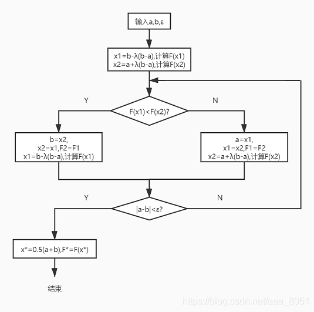
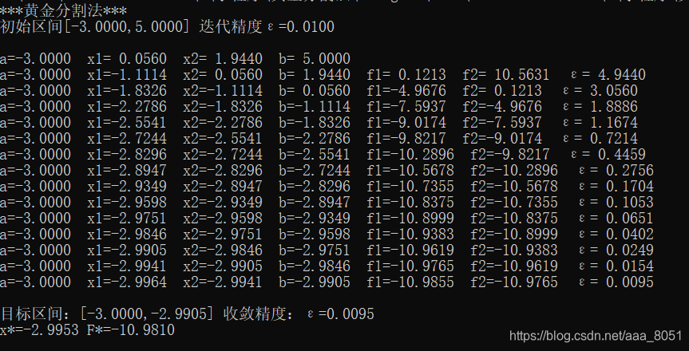

# 黄金分割法确定近似解(C语言)

> 原创 已于 2025-12-07 00:09:12 修改 · 2.3k 阅读 · 4 · 21 · CC 4.0 BY-SA版权 版权声明：本文为博主原创文章，遵循 CC 4.0 BY-SA 版权协议，转载请附上原文出处链接和本声明。
> 文章链接：https://blog.csdn.net/aaa_8051/article/details/109109390

## 黄金分割法确定近似解

- 优化设计

##### 黄金分割法程序框图



##### C语言程序

```c
#include <stdio.h>
#include <math.h>
//定义函数
#define F(x) (x*x+10*x+10)

//参数说明：[a0,b0]初始区间，e0迭代精度
void GoldenSectionMethod(float a0, float b0, float e0)
{
	float f1, f2;
	float x1, x2;
	float a, b, e;
	float xn = 0, fn = 0;
	//初值计算
	a = a0;
	b = b0;
	e = e0;
	x1 = b - 0.618 * ((double)b - a);
	x2 = a + 0.618 * ((double)b - a);
	f1 = F(x1);
	f2 = F(x2);
	printf("***黄金分割法***\r\n初始区间[%.4f,%.4f] 迭代精度ε=%.4f\r\n\r\n", a0, b0, e0);
	printf("a=% .4f  x1=% .4f  x2=% .4f  b=% .4f\r\n", a, x1, x2, b);
	//迭代计算，直至|a-b|<ε
	do
	{	
		if (f1 < f2)
		{	//消去[x2,b]区间，新的区间为[a,x2]
			b = x2;
			x2 = x1;
			f2 = f1;
			x1 = b - 0.618 * ((double)b - a);
			f1 = F(x1);
		}
		else
		{	//消去[a,x1]区间，新的区间为[x1,b]
			a = x1;
			x1 = x2;
			f1 = f2;
			x2 = a + 0.618 * ((double)b - a);
			f2 = F(x2);
		}
		printf("a=% .4f  x1=% .4f  x2=% .4f  b=% .4f  f1=% .4f  f2=% .4f  ε=% .4f\r\n", a,x1,x2,b,f1,f2, (float)fabs((double)b - a));
	} while ((float)fabs((double)b - a) > e);
	printf("\r\n目标区间：[%.4f,%.4f] 收敛精度：ε=%.4f", a,b,(float)fabs((double)b - a));
	//计算x*，F*
	xn = 0.5*((double)a + b);
	fn = F(xn);
	printf("\r\nx*=%.4f F*=%.4f\r\n",xn,fn);
}

int main()
{
	GoldenSectionMethod(-3, 5, 0.01);
	return 0;
}
```

##### 测试结果



欢迎反馈交流!